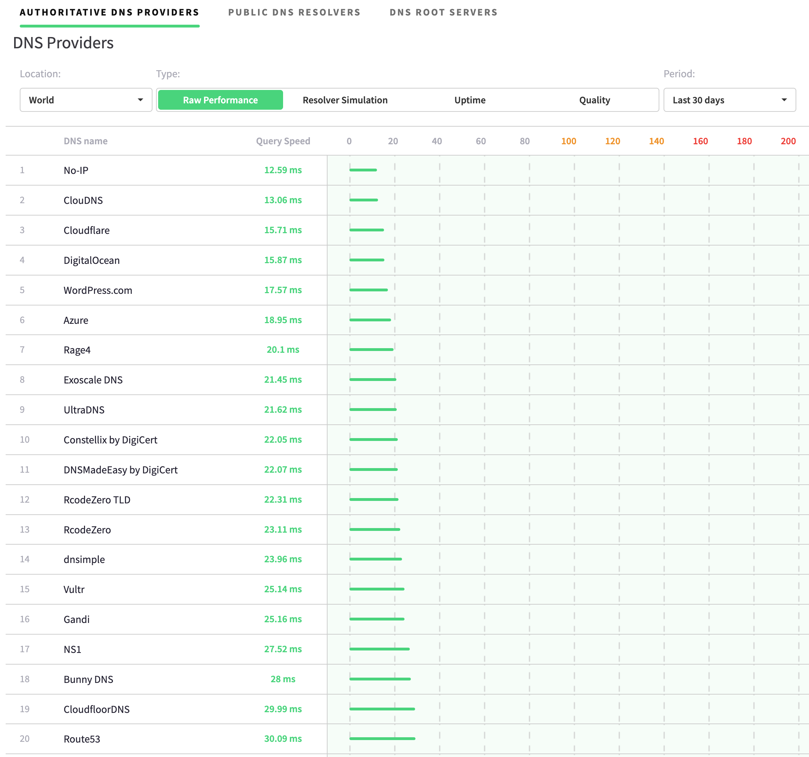

# DNS 성능
- [DNSPerf](https://www.dnsperf.com/#!dns-providers)를 참조하세요.
- (2025년 3월 11일 기준) 전 세계 Authoritative NS 제공자 기준 raw performance로만 보았을때 Cloudflare는 3위에 위치합니다 (평균 쿼리 속도 15.71ms). 상위 20개를 캡쳐하였습니다.

- Cloudflare는 Authoritative NS 뿐만 아니라, 전세계 모든 클라이언트가 사용 가능한 퍼블릭 DNS 리졸버인 1.1.1.1을 운영하며, 해당 Performance는 아래와 같습니다.

# 