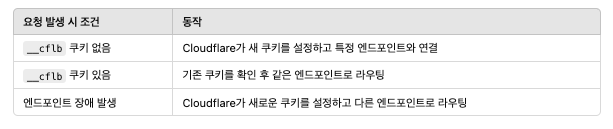

# LB의 종류
## L7 LB
- [여기](https://developers.cloudflare.com/learning-paths/load-balancing/planning/types-load-balancers/)를 참조하세요.
- L7 LB는 각 HTTP/HTTPS 요청에 포함된 정보(HTTP 헤더, URI, 쿠키, 데이터 유형 등)를 기반으로 특정 엔드포인트로 트래픽을 전달합니다.
- 클라이언트가 애플리케이션을 방문하면, Cloudflare는 (1) 트래픽 스티어링 정책과 (2) 엔드포인트 가중치에 따라 요청을 정상적인 엔드포인트로 라우팅합니다.
- Cloudflare 설정이 proxy (오렌지 구름) 일때 수행됩니다.

### 장점
- DNS 전용 LB와의 비교 대비 장점을 의미합니다.

  + 엔드포인트의 IP 주소를 숨겨 DDoS 공격으로부터 보호
  + DNS 캐싱의 영향을 받을 수 있는 경우보다 더 빠른 페일오버와 정확한 라우팅을 제공
  + Cloudflare의 캐싱, Workers, WAF와 같은 다른 기능과 통합
  + 맞춤형 세션 지속성 (session affinity) 및 엔드포인트 드레인을 지원

 

## DNS only LB
- DNS 전용 로드 밸런서는 클라이언트의 DNS 쿼리에 대한 응답으로 특정 IP 주소를 반환하여 트래픽을 라우팅합니다.
- 클라이언트가 앱을 방문할때, Cloudflare가 트래픽 스티어링 정책과 엔드포인트 수준의 스티어링 정책에 따라 정상적인 엔드포인트의 주소를 제공합니다. 그러나 DNS 쿼리 응답에 의존하므로, 클라이언트가 캐시된 응답을 가진 경우 이전 목적지로 연결, LB를 무시하게 될 수 있습니다.
- Cloudflare 설정이 unproxied (회색 구름) 일때 수행됩니다.

### 제한 사항
- L7 LB와의 비교 대비 제한 사항을 의미합니다.

  + 엔드포인트의 IP 주소를 숨기지 않으므로, DDoS 공격에 취약할 수 있습니다.
  + DNS 리졸버와 캐시 설정에 의존해야 하므로, failover가 느리고 라우팅 정확도가 낮습니다.
  + Cloudflare의 캐싱, Workers, WAF 등의 기능과 통합할 수 없습니다.
  + Cloudflare에 대한 권한 쿼리를 증가시켜, 사용량 기반 청구를 사용하는 고객에게 추가 비용이 발생할 수 있습니다.
  + Session Affinity를 지원하지 않습니다.

 

## L4 LB
- L4 LB는 Spectrum의 일부로만 지원됩니다.
- Spectrum은 TCP 수준에서 동작하므로 아래 기능은 지원되지 않습니다.
  
  + Session Affinity
  + Custom Rules
  + Caching

 

# Session Affinity
- 세션 어피니티(Session Affinity)를 활성화하면, 로드 밸런서가 특정 사용자의 모든 요청을 동일한 엔드포인트로 보내도록 설정됩니다.
- "_cflb" 쿠키 설정, 이를 확인해 이전과 동일한 엔드포인트로 요청을 보냅니다.

 

# Endpoint Steering Policy
- 엔드포인트 스티어링은 풀 내에서 트래픽을 각 엔드포인트로 분배하는 방식을 설정하는 기능입니다.
- 트래픽의 분배는 다음 두 가지 요소의 조합으로 결정됩니다.

  + (1) 엔드포인트 스티어링 정책
  + (2) 각 엔드포인트에 할당된 가중치
- 단, DNS only LB의 경우 DNS 리졸버의 캐싱으로 인해 트래픽 분배가 예상과 다르게 동작할 수 있습니다.

| 기능  | 동작 |
|------|----|
| Endpoint Steering 정책 | (1) 랜덤(Random): 모든 엔드포인트에 동일한 확률로 트래픽을 배분  (2) 해시(Hash): 클라이언트 IP 주소 등을 기반으로 트래픽을 특정 엔드포인트에 집중 |
| 가중치 | 가중치(Weight)는 각 엔드포인트가 받는 트래픽 비율을 조정하는 값 |

 

# Traffic Steering

| 기능  | 동작 |
|------|----|
| Off: Cloudflare will route pools in failover order  | - Cloudflare가 지정된 풀 순서(failover order)대로 트래픽을 라우팅  - 즉, 첫 번째 풀이 다운되면 다음 풀로 이동하는 방식 | 
| Dynamic steering | - 헬스 체크(Health Check, RTT)에서 측정된 지연 시간(latency) 데이터를 기반으로 가장 빠른 풀로 트래픽을 라우팅 |
| Geo steering | - Cloudflare의 지역(Region) 기준으로 특정 풀로 트래픽을 라우팅  - 예를 들어, 미국 요청은 미국 풀로, 유럽 요청은 유럽 풀로 자동 라우팅 |
| Proximity steering | -  사용자의 물리적 위치와 가장 가까운 풀로 요청을 라우팅  - GPS 좌표(위도/경도)를 기반으로 계산 |
| Random steering | - 정상(Healthy) 상태의 풀 중 하나를 무작위 또는 가중치(Weighted Random)에 따라 선택하여 트래픽을 배분 |
| Least outstanding requests steering | - 각 풀의 가중치(Weight) 및 현재 대기 중인 요청 수(Pending Requests)를 고려하여 트래픽을 라우팅 |