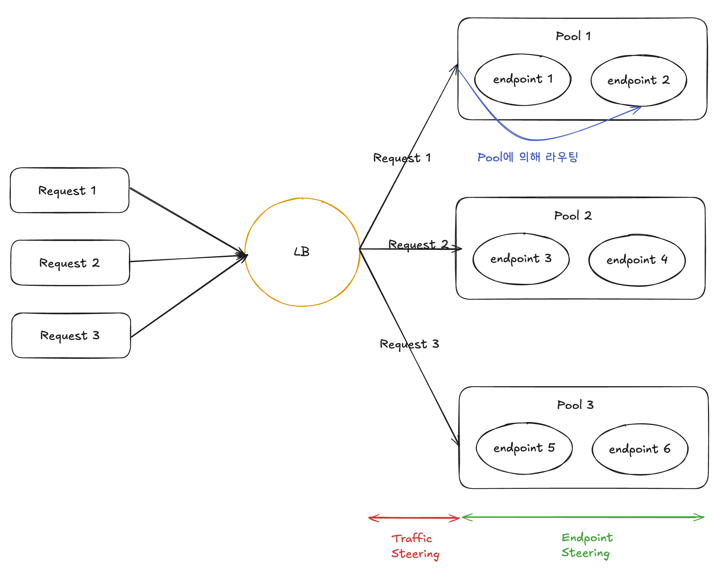

[What is Load Balancing?](#what-is-load-balancing)

&nbsp;&nbsp;&nbsp;&nbsp;[Monitors and health checks](#monitors-and-health-checks)

&nbsp;&nbsp;&nbsp;&nbsp;&nbsp;&nbsp;&nbsp;&nbsp;[How monitor works?](#how-monitor-works)

&nbsp;&nbsp;&nbsp;&nbsp;[트래픽 라우팅 체크리스트](#트래픽-라우팅-체크리스트)

# What is Load Balancing?
- [여기](https://developers.cloudflare.com/learning-paths/load-balancing/concepts/load-balancing/)를 참조합니다.
- 인터넷에서 로드 밸런싱은 트래픽을 여러 서버에 분산시키는 것을 의미합니다.
- 이 과정을 통해 각 서버의 부담을 줄이고, 더 효율적으로 동작하게 하며, 요청에 더 빠르게 응답할 수 있도록 합니다.
- LB는 주로 다음 세 개의 컴포넌트로 구성됩니다.
  + 일반적으로, LB 없이는 애플리케이션의 트래픽은 오리진 서버로 곧장 가게 됩니다.
  + LB가 있다면, 리퀘스트는 LB로 향하며, LB가 트래픽을 어떤 풀에 라우팅할지 결정하게 됩니다.
  + 풀 내에서 리퀘스트는 엔드포인트로 향하며, 이 엔드포인트가 리퀘스트에 응답하게 됩니다.

| 기능  | 동작 |
|------|----|
| Pool | - 하나 이상의 엔드포인트를 포함하는 단위입니다. |
| Endpoint | - 각각의 리퀘스트에 대해 응답할 엔드포인트 (서버 등) 입니다. |
| LB | - 트래픽을 어느 풀로 보낼지 결정하는 컴포넌트입니다. |

## Monitors and health checks
- [여기](https://developers.cloudflare.com/learning-paths/load-balancing/concepts/health-checks/)를 참조합니다.
- LB에서는 고려해야 할 요소가 많은데, 그 중 하나가 "요청을 처리할 수 있는 서버"로 트래픽을 전달해야 한다는 것입니다.
- 아러한 특성 때문에 다음 개념이 등장합니다: Monitor / Health Check

### How monitor works?
- 모니터는 풀 내 각 서버의 상태를 평가하기 위해 주기적으로 헬스 체크를 수행합니다. 이를 통해 LB가 "어떤 서버가 정상적으로 요청을 처리할 수 있는지" 판단합니다.
- 정해진 시간 간격마다 요청을 보내고, 설정에 따라 Pass / Fail 여부를 반환해 엔드포인트가 Healthy 하다는 것을 체크합니다.
- 모니터는 요청에 대해 다음을 검증하기 위해 실행됩니다. 아래 중 하나라도 "아닌" 경우 엔드포인트는 헬스 체크에서 실패합니다.

| 검증 항목 | 판단 기준 |
|------|----|
| 어떤 엔드포인트가 오프라인인가? | - 엔드포인트가 헬스 모니터 요청에 아예 응답하지 않는가?  - 응답이 너무 느리지는 않은가? (모니터 설정의 Timeout 값 기준) |
| 엔드포인트가 정상적으로 작동하는가? | - 헬스 모니터 요청에 예상된 HTTP 응답 코드가 반환되는가? - 응답 본문에 특정한 정보가 포함되어 있는가? |

## 트래픽 라우팅 체크리스트

| 체크리스트  | 체크 방법 |
|------|----|
| LB의 요청 분배 방식 (to Pool) | - 지리적 거리 (Proximity)  - 풀의 성능 (performance)  - 사용자 위치 (Geography) 등 |
| Pool의 요청 분배 방식  (to Endpoint, 엔드포인트 스티어링) | - 기본 트래픽 할당 비율 (Weight)  - IP 같은 요청의 속성  - 위 두 가지 조건 혼합 |
| Pool 내 정상 서버 판단 방식 | - Health Check에 실패한 엔드포인트는 Unhealthy로 표시  - 엔드포인트 스티어링 정책에 따라 비정상 서버 제외, 라우팅 조정 |
| LB 내 정상 Pool 판단 방식 | - Pool에 비정상 서버가 많다면 풀 자체가 비정상으로 간주될 수 있음  - Pool이 Critical인 경우 트래픽 스티어링 정책에 따라 트래픽 재조정  |
| 툭정 라우팅 규칙 유무 체크 | - 특정 설정을 통해 트래픽 스티어링 조정 가능  (요청의 특정 속성(예: 사용자 위치, 요청 유형 등)에 따라 라우팅 등) |