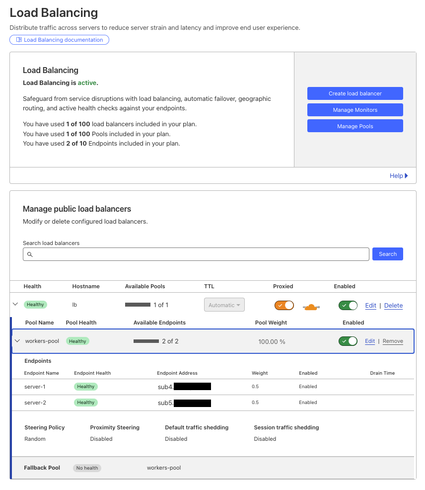
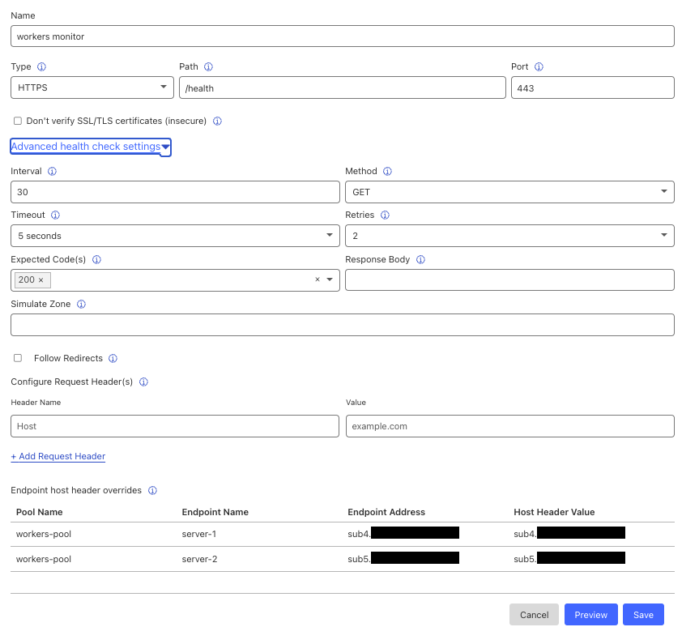
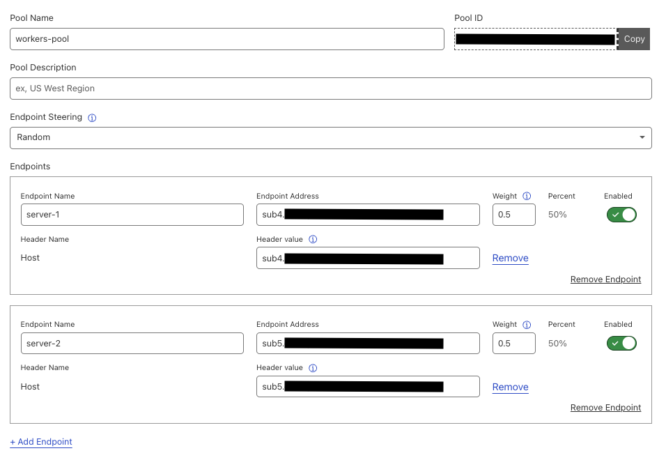
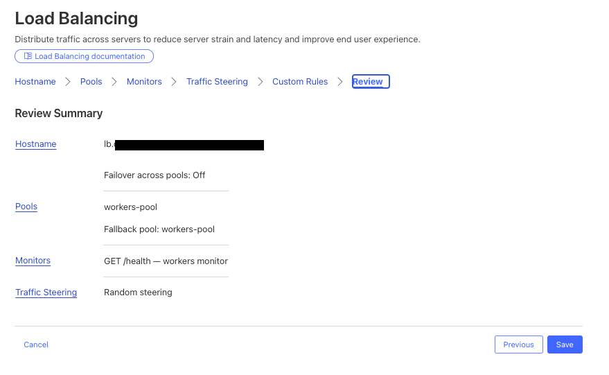
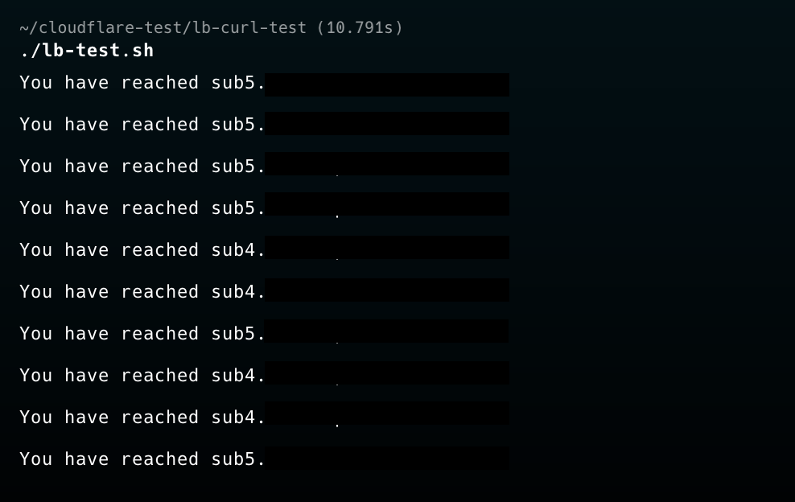

- 해당 테스트는 L7 LB 기준입니다.

# Dashboard
- 대시보드에서는 아래와 같이 현재 설정된 LB, Pool, Endpoint를 한 눈에 확인할 수 있으며, 메뉴도 크게 다음과 같이 나뉩니다.
  + (1) LB 생성
  + (2) Monitor 생성
  + (3) Pool 생성

  

 

# 1. Create Monitor 
- 모니터는 다음 정보를 포함하며, 이때 사용 가능한 프로토콜은 Non-ENT 고객과 ENT 고객이 차이가 있으니 주의해주세요.

| 기능  | 입력 데이터 |
|------|----|
| Type (프로토콜) | - Non ENT 고객: HTTP, HTTPS, TCP 중 선택  - ENT 고객: HTTP, HTTPS, TCP, UDP ICMP, ICMP Ping, SMTP 중 선택 |
| Path | 헬스 체크 요청을 실행할 엔드포인트 경로 입력 (예: /health) |
| Port | 헬스 체크를 실행할 대상 포트 (예: 80 또는 443) |
| Interval | 기본값보다 높이면 장애 조치(페일오버) 시간이 단축되지만, 엔드포인트에 부하가 증가할 수 있음 |
| Timeout 및 Retries | - 헬스 체크 요청이 Timeout을 초과하면 "Unhealthy(비정상)"으로 간주됨  - Timeout 기준을 초과하는 횟수가 Retries보다 많으면 해당 엔드포인트는 비정상 상태로 판단됨  |
| Expected Code | 기대하는 HTTP 응답 코드를 개별 입력 (예: 200, 302) 또는 범위 지정 (2xx → 모든 200대 응답 허용) |
| Response Body | 응답 본문 내 특정 문자열이 포함되어 있는지 확인 (대소문자 구분 없음) |
| 기타 | Simulate Zone, Follow Redirects, Configure Request Headers |

 

# 2. Create Pool
- Pool 설정은 다음과 같습니다.

| 기능  | 입력 데이터 |
|------|----|
| 1. Pool 생성 | 고유한 이름, 설명 (Optional), Endpoint Steering 방식|
| 2. 엔드포인트 추가 | 고유한 이름, endpoint 주소 (호스트 이름), Weight (가중치) |
| 3. (Optional) Proximity Steering 설정  | 각 풀에 위/경도 정도를 넣고 이를 기반으로 steering |
| 4. 기타 설정 | Health Threshold, Monitor, Health Monitor Regions, Pool Notifications |

# Create LB
- LB는 다음 설정을 포함합니다.

| 기능  | 입력 데이터 |
|------|----|
| 기본 설정 | Hostname, Session Affinity, Proxy 모드 설정 |
| Pool 설정 | 위에서 만든 pool 선택 및 Fallback pool 설정 |
| Monitor 설정 | 위에서 만든 Monitor 설정 |
| Traffic Steering 방식 설정 | Traffic Steering 방식은 [여기](https://developers.cloudflare.com/load-balancing/understand-basics/traffic-steering/steering-policies/)를 참조 |
| Custom Rule 설정 | URI가 /api/로 시작하면 특정 풀로 보내는 등의 커스텀 동작 수행 |

# Test
- 실제로, 해당 테스트는 Endpoint steering을 0.5로 주었기 때문에, curl을 10번 정도 날려 random steering이 되는지 확인합니다. 실제로도 아래와 같이 랜덤으로 분배되는 것을 볼 수 있습니다.

