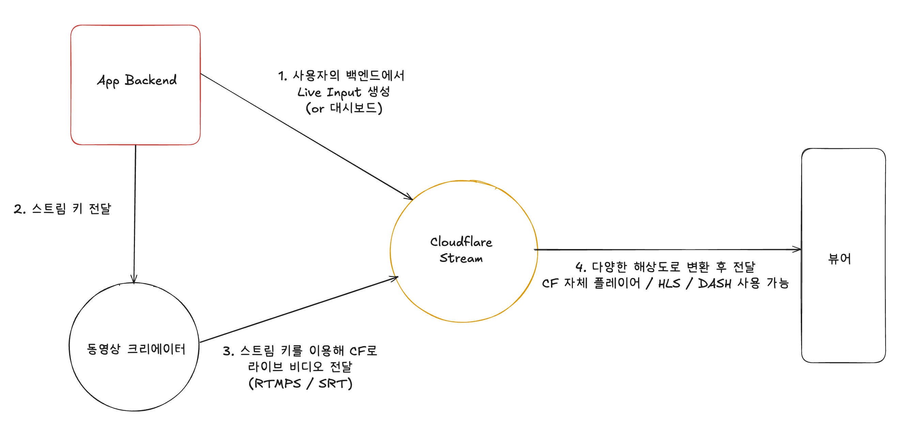

[Stream](#stream)  
&nbsp;&nbsp;&nbsp;&nbsp;[비디오 업로드](#비디오-업로드)  
&nbsp;&nbsp;&nbsp;&nbsp;[라이브 비디오 스트리밍](#라이브-비디오-스트리밍)  
&nbsp;&nbsp;&nbsp;&nbsp;&nbsp;&nbsp;&nbsp;&nbsp;[How stream works?](#how-stream-works)  
&nbsp;&nbsp;&nbsp;&nbsp;[비디오 재생 (VOD)](#비디오-재생-vod)  

# Stream
- 서버리스 라이브 및 VOD 스트리밍을 위한 제품입니다.
- Cloudflare의 스트림을 통해 비디오를 위한 인프라를 구성하거나 유지보수 할 필요 없이 하나의 API를 통해 라이브 및 VOD를 업로드, 저장, 인코딩 및 전송할 수 있습니다.
 

## 비디오 업로드

| 기능  | 동작 |
|------|----|
| [기본 업로드 기능](https://developers.cloudflare.com/stream/uploading-videos/upload-video-file/) | - 200MB를 초과하지 않는 작은 파일의 경우 다음과 같이 업로드할 수 있다.  1. 대시보드를 통한 업로드   + 드래그 & 드롭, 파일 선택  2. Stream API를 이용한 업로드   + Content-Type 헤더를 multipart/form-data로 설정하여 POST 요청을 수행 |
| [대용량 파일 업로드 (tus)](https://developers.cloudflare.com/stream/uploading-videos/resumable-uploads/) | - 200MB를 초과하는 대용량 파일의 경우, tus 프로토콜을 사용해 이어 올리기 (resumble upload) 기능을 활용할 수 있다.  - Python, Golang, Node.js 등의 언어로 다양한 tus 클라이언트를 사용할 수 있다. |
| [링크를 통한 업로드](https://developers.cloudflare.com/stream/uploading-videos/upload-via-link/) | - 클라우드 스토리지에 저장된 비디오 파일을 직접 가져올 수 있다. 파일의 HTTP URL을 제공하면 Stream이 자동으로 다운로드 및 인코딩을 수행한다.|
| [크리에이터의 직접 업로드](https://developers.cloudflare.com/stream/uploading-videos/direct-creator-uploads/) | - "/stream/direct_upload" 혹은 "/stream?direct_user-true" 등의 API endpoint를 통해 API 토큰을 노출하지 않고도 사용자가 비디오를 업로드할 수 있도록 일회용 URL을 생성할 수 있다. |

 

## 라이브 비디오 스트리밍

### How stream works?
- 원본 설명은 [여기](https://developers.cloudflare.com/stream/stream-live/)를 참조하세요.

1. 각 라이브 스트림은 Live Input을 생성 (대시보드 또는 API를 통해 생성 가능)
2. Live Input은 고유한 Stream Key를 가지며, 동영상 크리에이터에게 이 Stream Key를 제공
3. 크리에이터는 RTMPS 또는 SRT 프로토콜을 통해 Cloudflare Stream으로 라이브 영상을 전송
4. Cloudflare의 Stream이 라이브 비디오를 여러 해당도로 인코딩하고, CF의 글로벌 네트워크를 통해 시청자에게 전달
     - 웹사이트에서 Cloudflare Stream player 또는 HLS/DAS를 지원하는 다른 비디오 플레이어를 사용하여 라이브 영상을 재생

| 기능  | 동작 |
|------|----|
| RTMP 재연결  | - 라이브 스트리밍 소프트웨어가 자동 재연결을 제공하면, Cloudflare Stream Live는 계속 스트림을 수신 (Ingest), 방송 가능  - 사용하는 각 소프트웨어에 대해 RTMP 피드 전송이 끊어졌을 때 자동 재연결 설정이 필요  - OBS 같은 일부 앱은 자동 제공이나, FFmpeg 등의 프로그램을 별도 설정 필요 |
| ABR (Adaptive Bitrate Streaming)  | - Cloudflare Stream은 사용자의 라이브 스트림 비트레이트를 분석하여 이러한 대역폭 예측 값을 동적으로 생성하고 업데이트한다. |
| 라이브 스트리밍 -> 녹화 전환  | - 라이브 스트리밍 종료 후 60초 이내 Recording 제공한다.  - 라이브 스트림 종료 후 ready가 되면 녹화본을 사용 가능, 재생 URL을 사용하면 된다. |

 

## 비디오 재생 (VOD)

| 기능  | 동작 |
|------|----|
|   |  |
|   |  |
|   |  |
|   |  |
|   |  |

 

## 비디오 변환

 

## 비디오 수정

 

## 비디오 관리

 

## 분석 도구