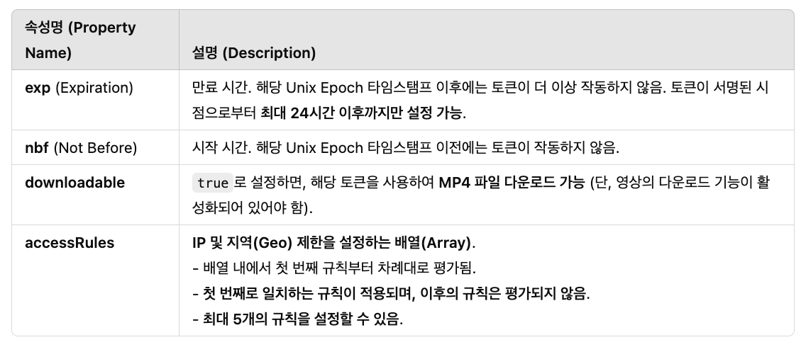

[Stream](#stream)

&nbsp;&nbsp;&nbsp;&nbsp;[비디오 업로드](#비디오-업로드)

&nbsp;&nbsp;&nbsp;&nbsp;[라이브 비디오 스트리밍](#라이브-비디오-스트리밍)

&nbsp;&nbsp;&nbsp;&nbsp;&nbsp;&nbsp;&nbsp;&nbsp;[How stream works?](#how-stream-works)

&nbsp;&nbsp;&nbsp;&nbsp;[비디오 재생 (VOD)](#비디오-재생-vod)

&nbsp;&nbsp;&nbsp;&nbsp;&nbsp;&nbsp;&nbsp;&nbsp;[보안 관련 옵션: Signed URLs / Tokens](#보안-관련-옵션-signed-urls-tokens)

&nbsp;&nbsp;&nbsp;&nbsp;[비디오 편집](#비디오-편집)

&nbsp;&nbsp;&nbsp;&nbsp;[비디오 관리](#비디오-관리)

&nbsp;&nbsp;&nbsp;&nbsp;[분석 도구](#분석-도구)

 

# Stream
- 서버리스 라이브 및 VOD 스트리밍을 위한 제품입니다.
- Cloudflare의 스트림을 통해 비디오를 위한 인프라를 구성하거나 유지보수 할 필요 없이 하나의 API를 통해 라이브 및 VOD를 업로드, 저장, 인코딩 및 전송할 수 있습니다.
 

## 비디오 업로드

| 기능  | 동작 |
|------|----|
| [기본 업로드 기능](https://developers.cloudflare.com/stream/uploading-videos/upload-video-file/) | - 200MB를 초과하지 않는 작은 파일의 경우 다음과 같이 업로드할 수 있다.  1. 대시보드를 통한 업로드   + 드래그 & 드롭, 파일 선택  2. Stream API를 이용한 업로드   + Content-Type 헤더를 multipart/form-data로 설정하여 POST 요청을 수행 |
| [대용량 파일 업로드 (tus)](https://developers.cloudflare.com/stream/uploading-videos/resumable-uploads/) | - 200MB를 초과하는 대용량 파일의 경우, tus 프로토콜을 사용해 이어 올리기 (resumble upload) 기능을 활용할 수 있다.  - Python, Golang, Node.js 등의 언어로 다양한 tus 클라이언트를 사용할 수 있다. |
| [링크를 통한 업로드](https://developers.cloudflare.com/stream/uploading-videos/upload-via-link/) | - 클라우드 스토리지에 저장된 비디오 파일을 직접 가져올 수 있다. 파일의 HTTP URL을 제공하면 Stream이 자동으로 다운로드 및 인코딩을 수행한다.|
| [크리에이터의 직접 업로드](https://developers.cloudflare.com/stream/uploading-videos/direct-creator-uploads/) | - "/stream/direct_upload" 혹은 "/stream?direct_user-true" 등의 API endpoint를 통해 API 토큰을 노출하지 않고도 사용자가 비디오를 업로드할 수 있도록 일회용 URL을 생성할 수 있다. |

 

## 라이브 비디오 스트리밍

### How stream works?
- 원본 설명은 [여기](https://developers.cloudflare.com/stream/stream-live/)를 참조하세요.

1. 각 라이브 스트림은 Live Input을 생성 (대시보드 또는 API를 통해 생성 가능)
2. Live Input은 고유한 Stream Key를 가지며, 동영상 크리에이터에게 이 Stream Key를 제공
3. 크리에이터는 RTMPS 또는 SRT 프로토콜을 통해 Cloudflare Stream으로 라이브 영상을 전송
4. Cloudflare의 Stream이 라이브 비디오를 여러 해당도로 인코딩하고, CF의 글로벌 네트워크를 통해 시청자에게 전달
     - 웹사이트에서 Cloudflare Stream player 또는 HLS/DAS를 지원하는 다른 비디오 플레이어를 사용하여 라이브 영상을 재생

| 기능  | 동작 |
|------|----|
| RTMP 재연결  | - 라이브 스트리밍 소프트웨어가 자동 재연결을 제공하면, Cloudflare Stream Live는 계속 스트림을 수신 (Ingest), 방송 가능  - 사용하는 각 소프트웨어에 대해 RTMP 피드 전송이 끊어졌을 때 자동 재연결 설정이 필요  - OBS 같은 일부 앱은 자동 제공이나, FFmpeg 등의 프로그램을 별도 설정 필요 |
| ABR (Adaptive Bitrate Streaming)  | - Cloudflare Stream은 사용자의 라이브 스트림 비트레이트를 분석하여 이러한 대역폭 예측 값을 동적으로 생성하고 업데이트한다. |
| 라이브 스트리밍 -> 녹화 전환  | - 라이브 스트리밍 종료 후 60초 이내 Recording 제공한다.  - 라이브 스트림 종료 후 ready가 되면 녹화본을 사용 가능, 재생 URL을 사용하면 된다. |

 

## 비디오 재생 (VOD)

| 기능  | 동작 |
|------|----|
| [자체 플레이어 사용](https://developers.cloudflare.com/stream/viewing-videos/using-own-player/)  | - Stream은 HLS 및 DASH를 지원하는 모든 비디오 플레이어와 호환된다.  - 이 두 프로토콜은 스트리밍 미디어의 표준 형식으로 웹 브라우저, 모바일 운영 체제 및 미디어 스트리밍 장치 전반에서 지원된다.  - 웹: HLS / DASH를 지원하는 모든 비디오 플레이어와 동작할 수 있다 (Video.js, hls.js, dash.js, vidstack)  - iOS: AVPlayer 등 사용 가능  - Android: ExoPlayer 등 사용 가능 |
| [Stream 플레이어 사용](https://developers.cloudflare.com/stream/viewing-videos/using-the-stream-player/) | - "iframe" 태그를 사용하여 플레이어 URL을 불러서 직접 사용 가능 |
| [썸네일 생성](https://developers.cloudflare.com/stream/viewing-videos/displaying-thumbnails/) | - 특정 시간의 썸네일을 실시간으로 생성 가능 (iframe, API 이용)  - GIF 생성 지원|
| [MP4 다운로드](https://developers.cloudflare.com/stream/viewing-videos/download-videos/) | - 오프라인 재생 용도의 MP4 다운로드 기능 활성화 가능  - /download 엔드포인트에 POST 요청을 보내 다운로드를 활성화하고, GET 요청을 보내 다운로드 링크를 가져옴  - 해당 URL에서 다운로드 |

### 보안 관련 옵션: Signed URLs / Tokens
기본 Stream에 업도르 된 비디오는 비디오 ID만 있다면 누구나 시청할 수 있으므로, 특정 사용자에게만 접근 권한을 부여하는 경우 Singed URL 기능을 사용할 수 있습니다.
비디오를 Signed URL이 필요하도록 설정하면 ("requireSignedURLs": true) Signed URL 토큰이 있어야 비디오를 시청/다운로드 할 수 있습니다.

- Singed Token을 생성하기 위해 다음 방법을 사용할 수 있습니다.
1. /token 엔드포인트를 사용하여 서명된 토큰 생성
  + only for test purpose (하루 10,000개 제한)
2. 오픈소스 라이브러리를 사용해 직접 생성
  + 사용자가 많은 경우 /token 엔드포인트를 매번 호출할 수 없음
  + 오픈소스 라이브러리를 사용해 직접 토큰을 생성할 수 있음
  + 이 경우 /stream/key를 호출해 pem/jwk를 얻어, 이를 이용해 토큰을 생성할 수 있음 (키는 1,000개까지 사용 가능)

Supported Restrictions

- 추가 사항
  + Hotlinking Protection (Allowed Origins 설정)
     - 기본 설정으로는 모든 도메인에서 영상을 임베드할 수 있으므로, 필요에 따라 특정 도메인에서만 임베드가 가능하도록 할 수 있다.
     - 비디오 옆에 "허용할 원본 도메인 입력 (Enter allowed origin domains separated by commas)" 라벨이 있는 텍스트 박스 이용
     - 이를 통해 어떤 도메인이 이 영상을 호출, 임베드할지 제어할 수 있다.

 

## 비디오 편집

| 기능  | 동작 |
|------|----|
| [오디오 트랙 추가하기](https://developers.cloudflare.com/stream/edit-videos/adding-additional-audio-tracks/) | - 비디오를 업로드한 후 추가 오디오 트랙을 첨부할 수 있다. 다음 API 사용  - https://api.cloudflare.com/client/v4/accounts/<ACCOUNT_ID>/stream/<VIDEO_UID>/audio/copy  - 오디오 추가, 목록 조회, 수정, 삭제 가능 |
| [캡션 추가하기](https://developers.cloudflare.com/stream/edit-videos/adding-captions/) | - 자막을 추가하는 방법은 (1) AI 생성 (2) 자막 파일 업로드 두 가지가 있다.  - <LANGUAGE_TAG> 값은 BCP 47 형식을 따라야한다.  (1) AI 생성의 경우, STT 기술을 사용, 생성 가능한 언어 목록 URL을 참고   (2) 직접 작성한 WebVTT 자막 파일을 업로드 가능, 다른 포맷은 변환이 필요하며 최대 파일 크기는 10M  - 주의: 비디오 업로드 선행 필요, WebVTT 포맷만 지원, 자막 언어 중복 불가, 최대 파일 크기 제한  - AI 자동 생성 기능, 파일 업로드, 목록 조회, 다운로드, 삭제 가능 |
| [워터마크 적용](https://developers.cloudflare.com/stream/edit-videos/applying-watermarks/) | - Cloudflare Stream API를 사용하여 업로드된 비디오에 워터마크(Watermark) 를 추가할 수 있다.  - 주의: 워터마크 프로필 수정 불가, 적용된 워터마크 변경 불가, 최대 파일 크기 2MiB, Support PNG only  - 워터마크 프로필 생성, 비디오 업로드 시 적용, 워터마크 조회, 워터마크 삭제|
| [플레이어 정보 추가](https://developers.cloudflare.com/stream/edit-videos/player-enhancements/) | - "publicDetails" 설정을 통해 동영상의 title, share_link, channel_link, logo를 추가, 관리할 수 있습니다. |
| [비디오 클립](https://developers.cloudflare.com/stream/edit-videos/video-clipping/) | - 트리밍 기술로, 비디오의 시작/끝 지점을 조정해 특정 부분만 보이도록 하는 기능이다.  - 기존 비디오에서 원하는 시작/끝 구간을 지정해 짧은 비디오 생성 가능 |

 

## 비디오 관리
- 비디오 처리 완료 등에 대한 알림을 웹훅을 통해 수신 가능 (http, https 지원)합니다.
- 자세한 내용은 [여기](https://developers.cloudflare.com/stream/manage-video-library/using-webhooks/)를 참조하세요.

 

## 분석 도구

| 기능  | 동작 |
|------|----|
| [GraphQL analytics API](https://developers.cloudflare.com/stream/getting-analytics/fetching-bulk-analytics/) | - 실시간 비디오 및 업로드된 VOD 비디오에 대한 분석 데이터 제공  - 한 번 요청에서 조회 가능 기간: 31일, 데이터 보관 기간: 90일| 
| Stream Dashboard | - 실시간 비디오 및 업로드된 VOD 비디오에 대한 분석 데이터 제공 | 
